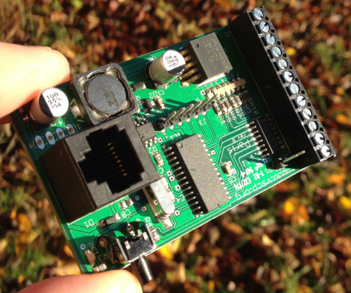

-----

<h1>Paris Relay module</h1>

This module is part of the VSCP project. It is free to use, modify and sell. The only thing we kindly ask is that improvements and extensions are contributed back to the project (at your will). This to make the project better for everyone. All design files is licensed under the MIT license.

The full documentation for the module can be found [here](http://grodansparadis.github.io/can4vscp_paris/#/).

This is one of two reference modules for the VSCP project. It is a module that can control up to seven relays.

## Abstract

Place An Alternate Description Here!
Paris is a relay module that connects to a CAN4VSCP bus and can control up to seven external relays. The module can be attached to a standard DIN Rail or be mounted directly on a wall (ordered as seperet versions).

The module fully adopts to the CAN4VSCP specification and can be powered directly over the bus with a 9-28V DC power source. It has a rich register set for configuration and any information events defined. It also have a decison matrix for easy dynamic event handling.

VSCP CAN modules are designed to work on a VSCP4CAN bus which use ordinary RJ-45 connectors and is powered with 9-28V DC over the same cable. This means there is no need for a separate power cabel. All that is needed is a CAT5 or better twisted pair cable. Buss length can be a maximum of 500 meters with drops of maximum 24 meters length (up to a total of 120 meters). As for all VSCP4CAN modules the communication speed is fixed at 125 kbps.

All VSCP modules contains information of there own setup, manual, hardware version, manufacturer etc. You just ask the module for the information you need and you will get it. When they are started up they have a default functionality that often is all that is needed to get a working setup. If the module have something to report it will send you an event and if it is setup to react on a certain type of event it will do it's work when you send event(s) to it. 

## Steps you should go through to adopt this file for your own VSCP project.

  * The frequency for your system may be different. This will affect the CAN bit rate settings which are defined in the biginning of the can18f.c file. Here you also find the filter/mask  defines if you need to change these. Timer0 is used as a 1 ms timer for the VSCP functionality. You should adopt the timer reload value in the main.h file to your system.

  * The GUID (Glocal Unique ID) is defined in the beginning of vscp.c This number should be different for each piece of equiment you produce. Regard it is as the device serial number. It can be moved to EEPROM if that is found more convinient. In that case the vscp_rcv_readreg  procedure in vscp.c also has to be changed.

  * The device URL is defined in the beginning of the vscp.c file. This is an URL without the initial "http://" that should point to a XML file that give information about your piece of equipment.

  * The manufacturer id is also defined in the beginning of the vscp.c file. You can use this id in any way you like.

In addition to this you may use different pins for the INIT button (RC0 today) and the status LED (RC1) today. Changes affect the main interrupt vector.
