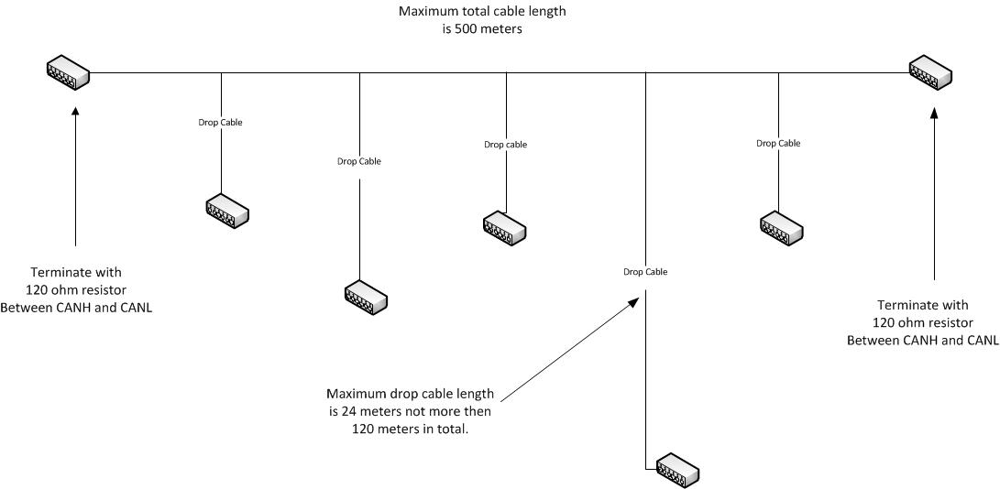
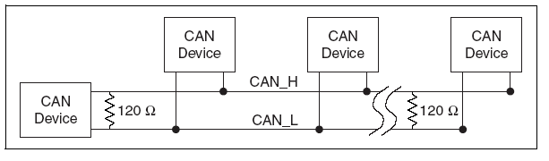

# Connecting CAN4VSCP devices

## Cable length

CAN4VSCP always communicate with 125kbps. This means that if you use a
good quality cable it can be up to a maximum of 500 meters using
AWG24AWG24 or similar (CAT5) . Actual length depend on the environment
and other parameters. Drops with a maximum length of 24 meters can be
taken from this cable and the sum of all drops must not exceed a total
of 120 meters.

CAN4VSCP bus with drops and terminations

## Termination

The CAN4VSCP bus, as all CAN based networks, should be terminated with a
120 ohms resistor between CANH and CANL at both ends of the cable.

If you use CAT5 this termination should be placed between the blue -
blue/white cables at both end of your bus.

On the board there is a jumper for an on-board terminator.

**Why is terminators required?**

Terminators are needed to cancel signal echos in the cable. In short you
get less noise in the cable if you use them. It is recommended to use
them even if at 125 kbit it is possible that your bus will work anyway
as CAN is pretty forgiving at this transmission speed.

## Power the module

You normally power the module through the RJ45 connector over the
CAN4VSCP bus. The voltage range is +9VDC - 28VDC.

It is possible to power the module on the TTL connector or to take power
from this connector if power is available on the CAN4VSCP bus.

## Best practice

Even if it is possible to have cable lengths up to 500 meters it is
better to stay at shorter distances to have some margins. Here are some
guidelines for a reliable set up

  - Total cable length of 300m, stub cables count double their length in
    that total.
  - Nodes count as 6m in that total. 
  - Never less than 30cm of cable between nodes, nor between a stub
    connection and a node. 
  - No more than 50 nodes connected.

Following this best practice you will have a setup that will work
reliable even in harsh environments.

  
[filename](./bottom-copyright.md ':include')
