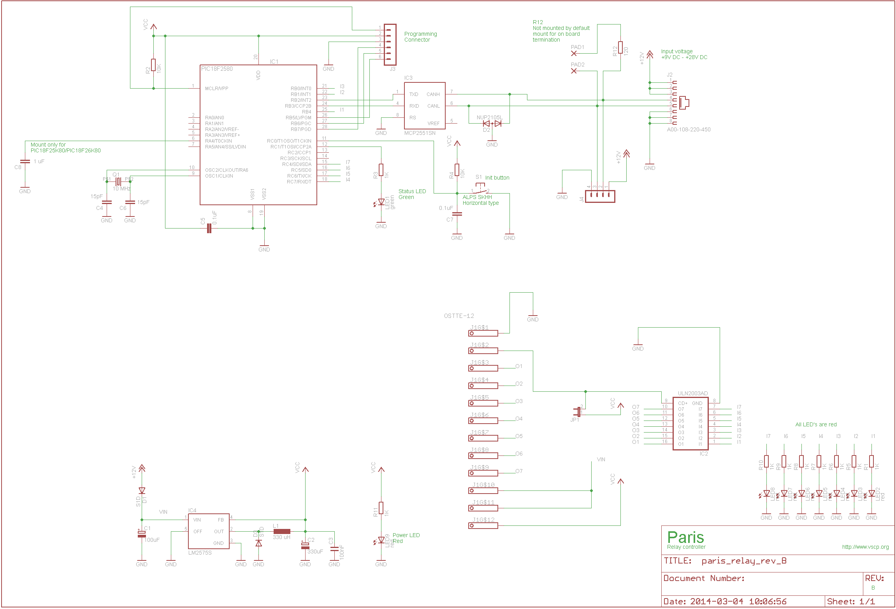
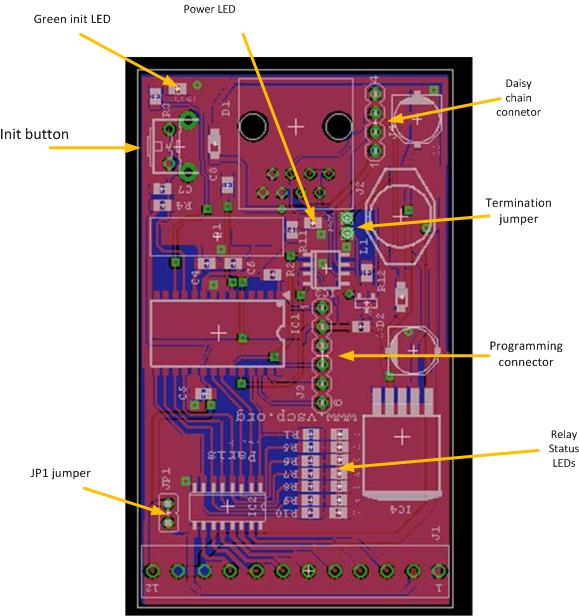
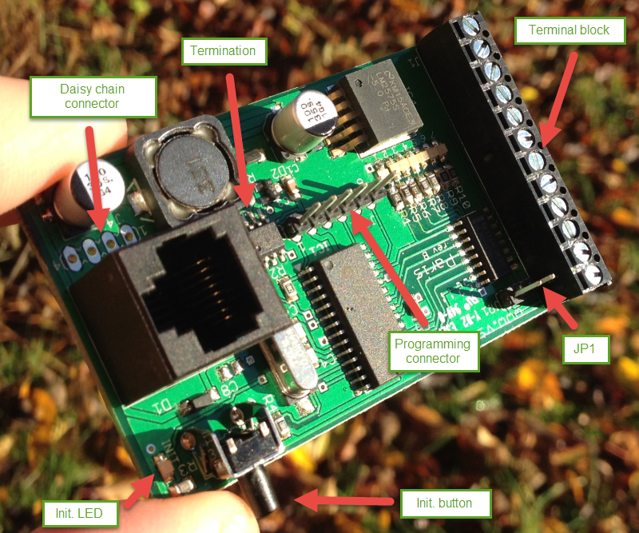
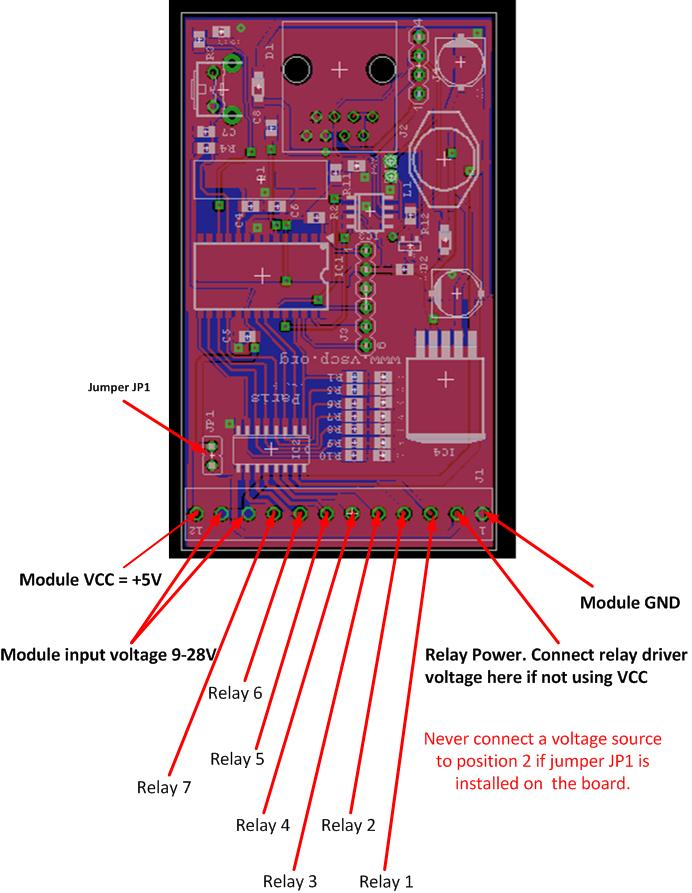
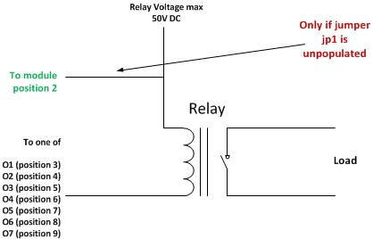

# Hardware

## Most current information

You can find the most current information about the Paris module [here](https://www.grodansparadis.com/paris/paris.html). On the site you can also find links to the latest firmware, drivers and schematics etc for its use.

## Installing the module

Connect the module to the CAN4VSCP bus. The red LED on the module should light up indicating that the device is powered. If this is the first time you start up the module the green lamp next to the initializing button will start to blink. This means that the module is trying to negotiate a nickname address with the rest of the modules on the bus. When it found a free nickname the green LED will light steady. If the green led does not start to blink press the initialization button until it does.

Now your module is ready to use. You have to decide what power source you should use for your relays. On position 12 of the terminal block connectors you can find +5V which can be used for this purpose. If you want to use +5V install the jumper JP1. Often however however +5V is a to low voltage to control relays. You need +12V or even +24V. This is OK. With the Paris module it is possible to use up to +50V DC. Before you connect this external voltage make sure that jumper JP1 is not installed. On position 10/11 you have the supply voltage for the module available. This is +9VDC - 28VDC and can also be used as your relay voltage.

## The raw facts

| Parameter | Value |
| --------- | ----- |
| Current hardware reversion      | B |
| Current firmware version        | 1.1.2 |
| Supply voltage                  | +9-+28 VDC |
| PCB Size                        | 42mm x 72mm |
| Power requirements              | 0.1W + relay driver power if used. |
| Communication: CAN4VSCP (CAN)   | 125 kbps |

## Schematics

Schematics: Rev B 

## Components

The **power LED** (red) will light when the board is powered.

The **green LED** show operational status. It blinks during
initialization process and lights steady under normal operation.

Press the **init. button** to initiate the node id discovery process. The green led will start to blink and do so until a new nickname id is found. If the LED never stops blinking that is an indication of some bus fault of some kind. Typically the module does not get an answer from another module on the bus.

The **daisy chain** connector is described below.

The Termination jumper activates a 120 ohm termination resistor between CANH and CANL if present. This is convenient if the module is the first or last module on a bus.

The firmware of a circuit equipped with a Microchip microprocessor usually can be programmed in circuit. That is when it is mounted on a printed circuit board. This is also true for the Paris relay module which have the programming connector on-board (J3). The **programming
connector** is used to reprogram the module. This is more convenient to do using the bootloader software but in debugging or if the bootloader has gotten corrupt connecting a standard Microchip PIC programmer to this connector is the only way to reprogram the module. If you have a programmer for Microchip processors (Real ICE, ICD-2, ICD-3, PICKIT-2, PICKIT3 or other) you can program your own firmware or the latest official firmware into the module using MPLABX or similar tools. You can always find a link to the latest firmware on the [Paris relay module
home page](http://www.grodansparadis.com/paris/paris.html).

**JP1 connector** This connector can be **dangerous** (the module can be damaged) so before you put it in make sure that you know what you do. It connects the module VCC to the relay driver voltage. So if it is shorted you must make sure that there is no other voltage applied to the relay voltage input.If it is the board will probably burn. It is however very convenient if you want to drive something with VCC (= +5V).

## Connectors

To activate the **termination** solder a cable between holes. This will activate the 120 ohm resistor between CANH and CANL.

### Terminal block

The individual positions for the twelve position termination block is numbered from the left (looking into it) as in the figure below. Ground, +5V and the power for the module is available from the board and the seven relay control positions. If you plan to use relays that can be
controlled with +5V just install jumper JP1 and connect +5V to the relays. Normally however you need to have a higher voltage such as +12V or +24V to control the the relays. In this case the JP1 jumper should be uninstalled. Connect the relay voltage (which can be taken from position
10/11 if a suitable voltage is used to power the module) to your relay and to position 2 of the termination block. By doing this you activate the fly-back protection diodes which protects the circuits from inductive loads. If you just have an resistive load you don\'t have to do this connection but there is no harm if you use it anyway.

The power used to power the Paris module is a perfect candidate for the relay voltage. It is available on the terminal block position 10/11.

| Pin | Description |
| --- | ----------- |
| 1   |  Ground (GND) |
| 2   |  Relay Power. Connect relay driver voltage here if NOT using VCC. |
| 3   |  Relay 1 |
| 4   |  Relay 2 |
| 5   |  Relay 3 |
| 6   |  Relay 4 |
| 7   |  Relay 5 |
| 8   |  Relay 6 |
| 9   |  Relay 7 |
| 10  |  Module input voltage +9V-28V |
| 11  |  Module input voltage +9V-28V |
| 12  |  +5V (Module VCC) |

**Important!**

**Never connect a voltage source to position2 if jumper JP1 is installed on the board.**

### Connecting relays

### RJ-XX pin-out

The unit is powered over the CAN4VSCP bus. The CAN4VSCP normally uses CAT5 or better twisted pair cable. You can use other cables if you which. The important thing is that the CANH and CANL signals uses a twisted cable. For connectors you can use RJ10, RJ11, RJ12 or the most common RJ45 connectors.

Recommended connector is RJ-34/RJ-12 or RJ-11 with pin out as in this table.

| Pin     | Used for  | RJ-11  | RJ-12 | RJ-45 |  Patch Cable wire color T568B |
|:-------:|:---------:|:------:|:-----:|:-----:| ----------------------------- |  
|  1      | +9-28V DC |        |       | RJ-45 | Orange/White |
|  2 1    | +9-28V DC |        | RJ-12 | RJ-45 | Orange |
|  3 2 1  | +9-28V DC | RJ-11  | RJ-12 | RJ-45 | Green/White |
|  4 3 2  | CANH      | RJ-11  | RJ-12 | RJ-45 | Blue |
|  5 4 3  | CANL      | RJ-11  | RJ-12 | RJ-45 | Blue/White |
|  6 5 4  | GND       | RJ-11  | RJ-12 | RJ-45 | Green |
|  7 6    | GND       |        | RJ-12 | RJ-45 | Brown/White |
|  8      | GND       |        |       | RJ-45 | Brown |

Always use a pair of twisted wires for CANH/CANL for best noise immunity. If the EIA/TIA 56B standard is used this condition will be satisfied. This is good as most Ethernet networks already is wired this way.

### Inter module connector

The inter module connector can be used to connect modules that are physically close to each other together in an easy way. Remember that the minimum length of a connection cable is 30 cm.

The **daisy chain connector** is an alternative to the RJ-45 connector and can be a very convenient way to connect boards together that are mounter close to each other, in the same cabinet for example. Our [power injector board](http://www.grodansparadis.com/pwrinjectcan/pwrinjectcan.html) is a perfect companion for this use.

| Pin | Description |
| :---: | ----------- |
| 1   | Power from CAN4VSCP bus (+9V-24V) |
| 2   | CANH |
| 3   | CANL |
| 4   | GND |

### PIC programming Connector

| pin | Description |
| :---: | ----------- |
| 1   | Reset |
| 2   | VCC |
| 3   | GND |
| 4   | PGD (RX of second serial port is here to) |
| 5   | PGC (TX of second serial port is here to) |
| 6   | LWPGM |

### Functionality of the status LED

The LED is used to indicate the status of the module. It will light steady when the firmware is running and will blink when the module is in the nickname discovery process.

| LED | Description |
| :---: | ----------- |
| Steady | No error. Firmware running. |
| Blinking | Module is going through the [nickname discovery process](https://grodansparadis.github.io/vscp-doc-spec/#/./vscp_level_i_specifics?id=address-or-nickname-assignment-for-level-i-nodes). |

### CAN

CAN4VSCP is a CAN based bus running at 125 kbps with the addition of DC power. If you are interested in how CAN works you have a pretty good intro [here](http://www.eeherald.com/section/design-guide/esmod9.html).

CAN is known to be robust and is there for used in vehicles and in the industry for that reason.

  
[filename](./bottom-copyright.md ':include')
