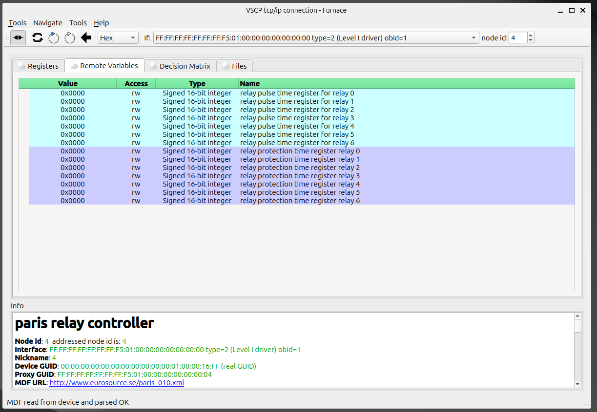

# Remote variables

Remote variables are used - just as registers - to read and write data from a remote device.  The remote device can be a sensor, an actuator, or any other device that can be read from or written to. You can read mote about remote variables in the [VSCP specification](https://grodansparadis.github.io/vscp-doc-spec/#/./vscp_register_abstraction_model?id=remote-variables). Remote variables relay on registers bit present content in registers on a higher abstraction level.

The following remote variables are available for the Paris module:

| Variable | Access | Type | Note |
| -------- | :------: | :----: | ----------- |
| relay pulse time register for relay 0    | r/w |  Signed 16-bit integer    | Time in seconds. |
| relay pulse time register for relay 1    | r/w |  Signed 16-bit integer    | Time in seconds. |
| relay pulse time register for relay 2    | r/w |  Signed 16-bit integer    | Time in seconds. |
| relay pulse time register for relay 3    | r/w |  Signed 16-bit integer    | Time in seconds. |
| relay pulse time register for relay 4    | r/w |  Signed 16-bit integer    | Time in seconds. |
| relay pulse time register for relay 5    | r/w |  Signed 16-bit integer    | Time in seconds. |
| relay pulse time register for relay 6    | r/w |  Signed 16-bit integer    | Time in seconds. |
| relay protection time for relay 0    | r/w |  Signed 16-bit integer    | Active relay will be turned off if not commanded to do so before time set here. Time in seconds. |
| relay protection time for relay 1    | r/w |  Signed 16-bit integer    | Active relay will be turned off if not commanded to do so before time set here. Time in seconds.  |
| relay protection time for relay 2    | r/w |  Signed 16-bit integer    | Active relay will be turned off if not commanded to do so before time set here. Time in seconds. |
| relay protection time for relay 3    | r/w |  Signed 16-bit integer    | Active relay will be turned off if not commanded to do so before time set here. Time in seconds. |
| relay protection time for relay 4    | r/w |  Signed 16-bit integer    | Active relay will be turned off if not commanded to do so before time set here. Time in seconds. |
| relay protection time for relay 5    | r/w |  Signed 16-bit integer    | Active relay will be turned off if not commanded to do so before time set here. Time in seconds. |
| relay protection time for relay 6    | r/w |  Signed 16-bit integer    | Active relay will be turned off if not commanded to do so before time set here. Time in seconds.|

[filename](./bottom-copyright.md ':include')