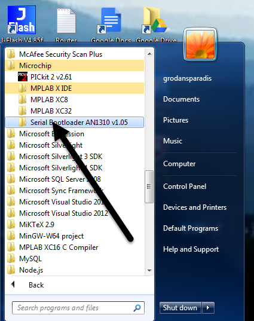
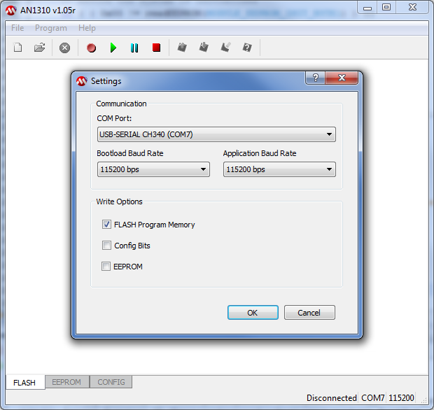
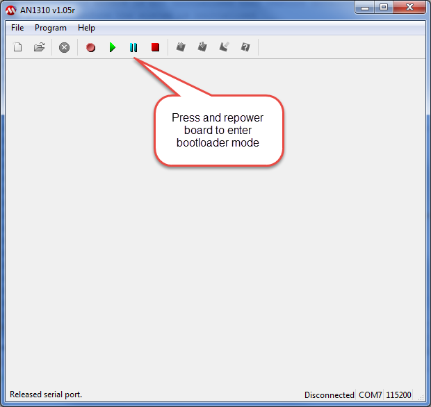
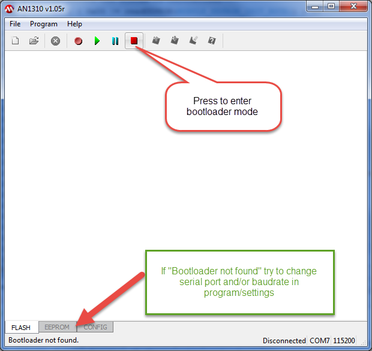
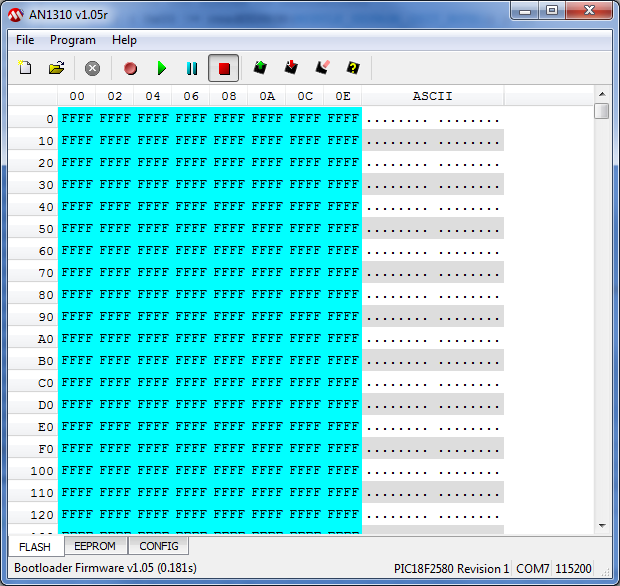
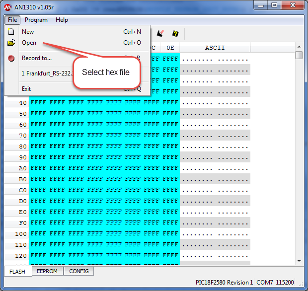
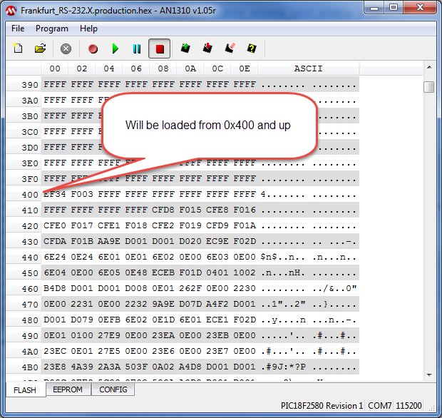
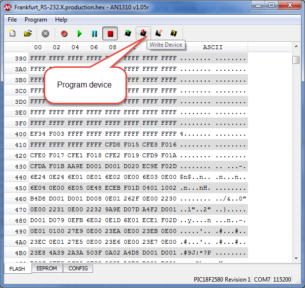
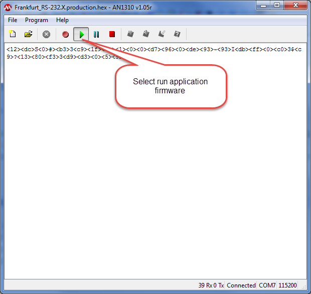
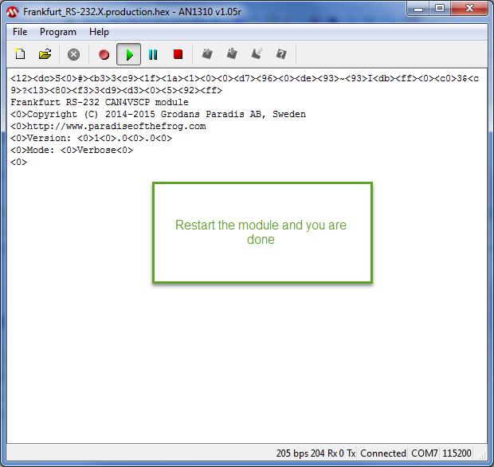

New firmware is released from time to time for all our modules. We
expect this to be true also for the Accra module as it is an active
project. The process of updating the firmware of the module is a simple
one. Just follow the steps outlined in the [VSCP Works
documentation](http://www.vscp.org/docs/vscpworks/doku.php?id=start).

## The bootloader application

First you should download and install [this
file](http://www.grodansparadis.com/downloads/Serial_Bootloader_AN1310_v1.05r.exe).
You can uninstall the file as soon as you are done uploading the
firmware of the Accra module.

After install you can find the executable under the Microchip folder in
the startup menu.

## Where is the firmware?

Firmware is available in the Github repository
<https://github.com/grodansparadis/can4vscp_accra/releases>

## Where is the source for the firmware?

You can find the latest source for the firmware
[here](https://github.com/grodansparadis/can4vscp_frankfurt_rs232).

## Setting communication parameters

You should set communication parameters to use before you start. You
find them under the menu /program/start of the bootloader program. This
will bring up this dialog

This is the recommended settings but you may need to lower the
bootloader baudrated if you have problem finding the module or problems
with the loading of the code. For most uses 115200 should work fine. The
Frankfurt RS-232 bootloader have an autobaudrate detector so any
baudrate will do. Note however that the application baudrate is locked
to 115200 baud and should not be changed.

## Setting the module into bootloader mode

You set the module into bootloader mode by restarting (turning of and
turning on) the module while the *break/Reset application firmware*
button of the bootloader application is pressed. You can also do the
same thing with the *BOOT command* in the verbose mode of the module.

while the break button is depressed then restart the board.

When the module is restarted you should press the *enter boot loader
mode* to activate the bootloader connection.

If you have set the wrong port, a baudrate tat does not work or the
module did not enter the bootloader firmware it wil show here. Change
settings and try again.

If all goes well you will get a new screen

It just show an empty flash memory.

At this point you need the firmware code so load it by selecting the hex
file under the /file/open menu.

After the hex file is loaded you should see code at offset 0x400 and
forward.

To program the module click *Write Device*

and the firmware will be written to the device.

You may get a complaint like this

after the code is loaded but this is no problem it s due to code
protection. Run the verify under the /program/verify menu to make sure
the write of the firmware was OK.

Thats it\!

Now select *run application firmware* and restart the board again and
the Frankfurt RS-232 application will run.

  
[filename](./bottom-copyright.md ':include')
